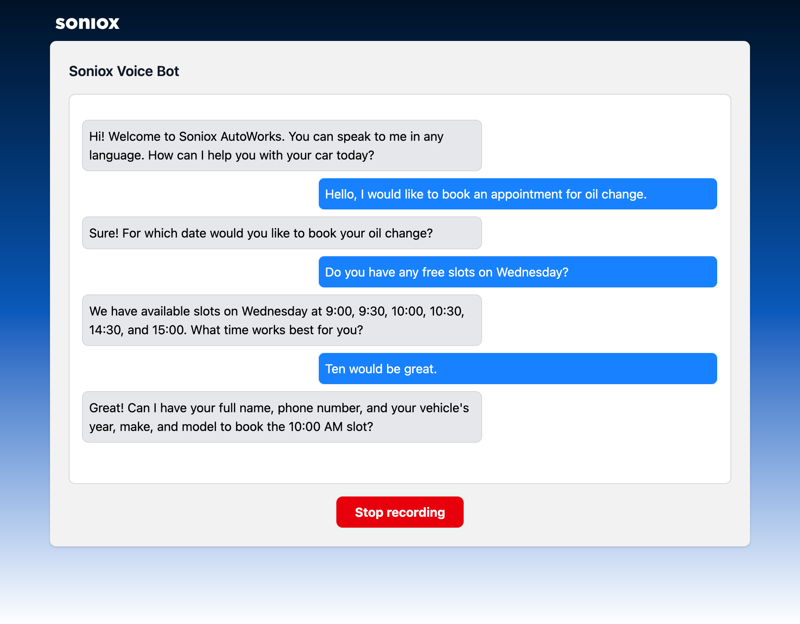

# Soniox Voice Bot frontend

A real-time, streaming frontend for the Soniox Voice Bot, built with React, TypeScript, and Vite.



## Overview

This project provides a simple user interface for interacting with the Soniox Voice Bot backend.
It captures microphone audio, streams it to the backend via WebSockets, and plays back the AI's audio response in real-time, creating a seamless conversational experience.

## Features

- Real-time voice conversation UI for interacting with the backend voice bot
- Audio recording and playback.
- Streaming speech transcription, LLM text responses and TTS audio

## Installation

1. Clone the repository and navigate to this directory:

   ```sh
   git clone https://github.com/soniox/soniox_examples.git
   cd apps/soniox-voice-bot-demo/frontend
   ```

2. Install dependencies:

   ```sh
   npm install
   # or
   yarn install
   # or
   pnpm install
   ```

3. Configure Environment Variables:
   Copy the example environment file. This file tells the frontend where to find the backend server.

   ```sh
   cp .env.example .env
   ```

   Edit `.env` to set the backend WebSocket URL and any other environment variables.
   By default, backend WebSocket server will be running on `ws://localhost:8765`.

## Language Selection

The frontend supports 60+ languages. During a conversation, you can select your preferred language from the dropdown menu. The bot will respond in the selected language.

## Running the development server

```sh
npm run dev
# or
pnpm dev
# or
yarn dev
```

The app will be available at [http://localhost:5173](http://localhost:5173) by default.

## Building for production

```sh
pnpm build
# or
npm run build
# or
yarn build
```

The production-ready static files will be generated in the `dist/` directory.

## Deploying with Docker

You can also build and run the frontend in a container using the provided Dockerfile.

```sh
# Build the Docker image
docker build -t soniox-voice-bot-frontend .

# Run the container
docker run -p 80:80 soniox-voice-bot-frontend
```
