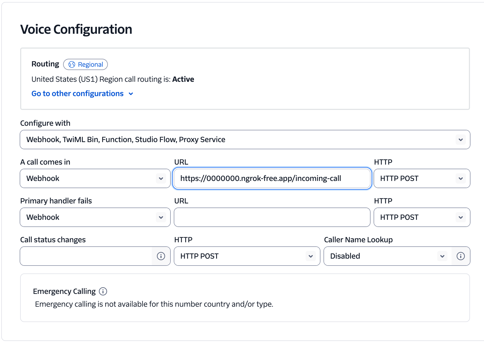

# Twilio proxy webserver for Soniox Voice Bot Demo

## Overview

This project provides a proxy webserver that connects Twilio phone calls to the Soniox voice bot, enabling real-time, AI-powered phone conversations.

It works by accepting incoming Twilio calls and forwarding the audio stream to a Soniox voice bot backend via WebSockets.
The bot's responses are then streamed back to the caller through Twilio.
This allows any business to deploy a multilingual, AI-driven phone agent without needing to build custom telephony infrastructure.

## How it works

The data flows through the system in a simple, real-time loop:

- **Incoming Call:** A user calls your Twilio phone number. Twilio establishes a media stream with this proxy server.
- **WebSocket Connection:** The proxy server opens a WebSocket connection to your Soniox voice bot backend.
- **Audio Streaming:** The proxy forwards the caller's audio from Twilio to the Soniox bot in real-time.
- **AI Processing:** The Soniox bot performs speech-to-text, understands the user's intent, and generates a response with text-to-speech.
- **Response Delivery:** The bot sends the synthesized audio response back to the proxy, which forwards it to Twilio to be played to the caller.

## Quick start

1. **Clone the repository:**

   ```sh
   git clone https://github.com/soniox/soniox_examples.git
   cd apps/soniox-voice-bot-demo/twilio
   ```

2. **Install Python dependencies:**

   This project uses `uv` for package management.

   ```sh
   # Create a virtual environment and activate it
   uv venv
   source .venv/bin/activate
   # Install Python dependencies
   uv sync
   ```

3. **Set up environment variables:**

   Copy `.env.example` to `.env` and fill in your Twilio and backend connection details:

   ```
   SONIOX_VOICE_BOT_WS_URL=ws://localhost:8765
   ```

   - `SONIOX_VOICE_BOT_WS_URL`: WebSocket URL of your Soniox voice bot backend
   - `PORT`: Port for the proxy server (default: 5050)
   - `VOICE_BOT_LANGUAGE`: Language for the voice bot (default: en)
   - `VOICE_BOT_VOICE`: Voice for the voice bot (default: female_1)

   [!NOTE] You should be running the Soniox voice bot backend server before running the proxy server. See the [server](../server) directory for instructions.

4. **Run the proxy server:**

   Execute the main application file. By default, it runs on port 5050.

   ```sh
   uv run main.py
   ```

5. **Expose the proxy server to the internet:**  
   Use a tool like ngrok to create a public URL for your local server. This is required for Twilio's webhook to reach it.

   ```sh
   ngrok http 5050
   ```

   Ngrok will provide a public "Forwarding" URL (e.g., `https://<unique-id>.ngrok-free.app`). You will need this URL to configure your Twilio phone number's webhook.

6. **Configure Twilio webhook:**
   You'll need a Twilio account and a phone number on that account to run this example.
   You can buy a phone number from the [Twilio console](https://console.twilio.com/us1/develop/phone-numbers/manage/search).

   Once you have your Twilio phone number and the public URL of your proxy server, you can navigate to your Twilio phone number's "Configure" page

   Set your Twilio phone number's webhook to point to ngrok's public URL, extending the URL with `/incoming-call`. See the screenshot below for an example.

   

   **Note:** Note on Latency: Twilio's infrastructure can add latency. For the best performance, choose a Twilio region (e.g., US1, IE1) that is geographically close to your proxy server, Soniox voice bot deployment and users.

7. **Test the voice bot:**  
   You can now call your Twilio phone number and test the voice bot.

   **Note:** When using a Twilio free trial account to make or receive calls, an additional disclaimer is played at the beginning of the call.

## Deployment

This application is ready for containerized deployment using Docker. A Dockerfile which can be used as a base for your own containerized deployment is provided.

1. Build the Docker Image

   ```sh
   docker build -t twilio-proxy .
   ```

2. Run the Docker Container

   When running the container, you must set the `SONIOX_VOICE_BOT_WS_URL` environment variable and map port `5050`.

   ```sh
   docker run -d \
     -p 5050:5050 \
     -e SONIOX_VOICE_BOT_WS_URL="ws://<your-bot-backend-host>:<port>" \
     twilio-proxy
   ```
